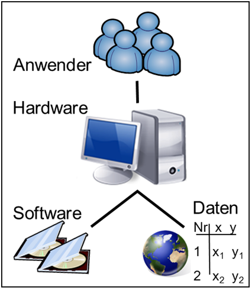

Ein Informationssystem (IS) dient der rechnergestützten Erfassung, Speicherung, Verarbeitung, Pflege, Analyse, Benutzung, Verbreitung, Disposition, Übertragung und Anzeige von Information bzw. Daten. (de.wikipedia.org/wiki/Informationssystem)

Üblicherweise benötigt jedes Informationssystem die vier Systemelemente Hardware, Software, Daten und Anwender. Für die Verarbeitung stellt ein Informationssystem i.d.R. dann vier funktionale Komponenten zur Verfügung: Erfassung, Verwaltung, Analyse und Präsentation von Informationen (das EVAP-Modell, vgl. Bill, 2016:5).

