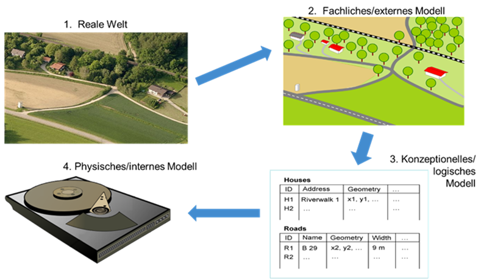

Zur Bearbeitung einer raumbezogenen Fragestellung wird ein Ausschnitt der realen Welt aus fachlicher Sicht betrachtet und in bedeutungsvollen Objektklassen aus Sicht der fachlichen Nutzung beschrieben (thematisches/fachliches oder auch externes Modell genannt) (siehe Abbildung).

Unter **thematischem/fachlichem oder externem Modellieren** versteht man die Beschreibung, Bearbeitung und Speicherung der zugrundeliegenden Thematik eines räumlichen Objekts. Thematisches Modellieren ist stets von der Anwendung abhängig. Jedoch finden  sich grundlegende Konzeptionen und damit Gemeinsamkeiten in vielen, voneinander unterschiedlichen Problemstellungen. Innerhalb der thematischen Modellierung können generell zwei unterschiedliche Vorgehensweisen unterschieden werden. Die ältere Methode zur Separation von verschiedener Thematik ist das sogenannte Ebenen- oder Folienprinzip. Für ein fachliches Thema wird entsprechend eine Ebene im GIS vorgehalten (Ebene des Gewässernetzes, Ebene der Geländehöhen, Ebene der Denkmalstandorte etc.). Wird innerhalb nur dieses einen Themas gearbeitet ist eine solche Modellierung recht effizient. Daneben  haben sich mittlerweile objektbezogene Modelle etabliert, die wesentlich flexibler thematische Zusammenhänge wiedergeben können. Dabei bedient man sich des sogenannten Objektklassenprinzips, bei dem ein Graph aufgebaut wird, der im einfachsten Fall einen Baum darstellt. Die Verzweigung des Baumes nach oben kann beliebig sein, d.h. einer Objektklasse wird eine komplexe Objektklasse überlagert. Leistungsfähige heutige GIS sind hier hybrid und unterstützen sowohl das klassische Ebenen- als auch das Objektklassenprinzip.

Diese werden im **konzeptionellen/logischen Modell** in einem Anwendungsschema modelliert z. B. in ihrem statischen Verhalten durch Verwendung von UML-Klassendiagrammen (Unified Modeling Language) und in einer für Datenbanken verständlichen Form (z. B. mittels Entitäten-Relationenmodell) und in Form von Tabellen in der Datenbank abgelegt. Die eigentliche physische Speicherung auf den Servern und Festplatten wird im **physischen/internen Modell** definiert (Bill, 2016, S. 19ff.).
